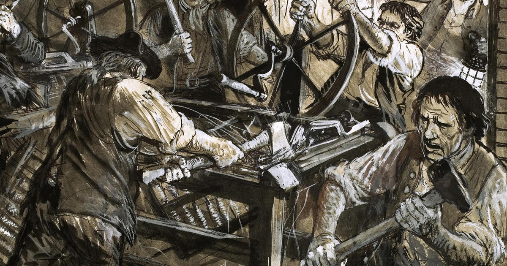
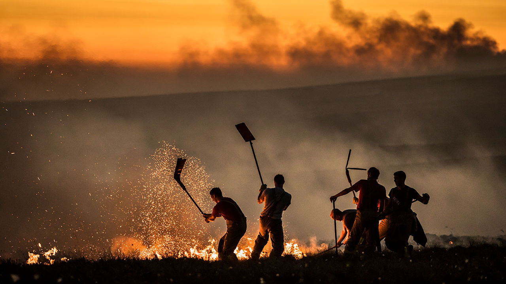

*When Marduk commanded me to give justice to the people of the land and
to let them have good governance, I set forth... to make justice appear
in the land, to destroy the evil and the wicked, that the strong might
not oppress the weak.*

—Hammurabi of Babylonia [\[1\]](#ref-driver2007babylonian)

All governments throughout history have been run by humans. Some have
claimed to serve the people of their society—others have blatantly
served a different goal. In the modern era, and governments play a
larger role in human life than ever before—everything from education to
urban planning is a function of the state. But have the motivations of
governments improved? The Bulletin of Atomic Scientists considers the
current political climate "as worrisome as the most dangerous times of
the Cold War" [\[2\]](#ref-mecklin2019new).

<figure>
<figcaption aria-hidden="true"><em>Marduk, ruler of the gods, gives legal power to Hammurabi, king of Babylonia</em> <a href="#ref-babylon" role="doc-biblioref">[3]</a></figcaption>
</figure>

Climate change has gotten to the point where many experts consider it
unavoidable [\[4\]](#ref-ghosh2018great). Wealth inequality throughout
the developed world has been getting worse
[\[5\]](#ref-knight2017wealth). Humans tend to be self-serving, fail to
think long-term, and exhibit bias towards members of their own groups,
among many other pitfalls [\[6\]](#ref-haselton2006paranoid). It is this
kind of flawed decision-making, typical of *Homo sapiens*, that causes
so much calamity.

With these flaws, we won’t be ruling the Earth forever. Artificial
Intelligence is improving by the day. According to the International
Data Corporation, global spending on AI is expected to double by 2022 to
almost $80 billion [\[7\]](#ref-globalAI). In the wake of this windfall,
we’ll start to see more intelligent systems—machines eventually capable
of performing all tasks better than humans
[\[8\]](#ref-bostrom2005history). What then? The stakeholders in the
future of AI include not only the human race, but also life on Earth and
potentially the entire universe—we can use the utility ethics test to
examine these scenarios. Should we put limits on AI to keep humans
employed? A Luddite approach will only hold us back, as governments or
corporations that implement these kind of regulations will inevitably be
outcompeted by those that do not. Even if the whole world got together
and agreed to put anti-AI laws into place (good luck getting North Korea
or the Mafia to agree to that anyway), what would be the purpose of
making humans do jobs robots can do better? Do we still have people draw
spreadsheets by hand?

<figure>
<figcaption aria-hidden="true"><em>Luddites, a group of textile workers, destroy the textile mills that replaced their jobs.</em> <a href="#ref-luddites" role="doc-biblioref">[9]</a></figcaption>
</figure>

Of course, Microsoft Excel isn’t going to revolt against us anytime
soon, but for the purposes of this paper we will assume that we have
solved the superintelligent control problem (as this is a technical
challenge) and are able to create friendly AI that won’t harm us.[1]
There is one job, though, that might seem smart to keep as a human
occupation. Leadership—an especially valued human quality—will likely be
the last job handed over to the machines. For our own sakes, it
shouldn’t be. Though it may scare some people, putting AI into power
will make a smarter, faster, and more equitable world.

In order to examine these questions, we can look at an automated
authority from the perspective of the utility test. With a machine
government, the average person would benefit financially from an
improved economy—the AI’s superior financial policy would make
recessions much less likely and put more money in the pockets of
everyday people [\[11\]](#ref-ernst2018economics). In this society, as
no humans work, the machines will remove all social classes. With no
humans working, it will be impossible to maintain that some humans
deserve more wealth. However, this would anger the rich, as their
institutions and old-boy networks within the financial system would no
longer give them power. In the long-term, though, the incredible
abundance produced by a post-scarcity economy (one where robots create
endless wealth distributed equally among all humans) might allow
everyone the type of luxuriant lifestyle previously only afforded to the
few [\[12\]](#ref-korinek2017artificial).

We could also release the source code of this AI so that any interested
citizen could literally read the mind of their leader, and even vote on
tweaks or improvements. This AI could be programmed to always act in the
perfect interest of the people
[\[10\]](#ref-bostrom2014superintelligence). If this AI’s programming
was made open-source, the average person would have much more confidence
in their government, something that is sorely lacking in many human
regimes today. Of course, while an AI government is great for the
citizens, it would be a nightmare for politicians as they would be out
of a job—though this might not be all bad, as the European Center for
the Governance of Change found that already 1/4 of citizens would prefer
AI to their current politicians [\[13\]](#ref-euro2019tech).

A true superintelligence could respond to threats instantly
[\[10\]](#ref-bostrom2014superintelligence). An economic crash or
surprise war would take human leaders off-guard, but an AI would be able
to watch the situation unfold at millions of frames per second. The
downside to this, though, is that the public won’t be able to react to
its decisions in time to modify it. We could create robust
guaranteed-friendly AI (that won’t kill us), but many members of the
public would still hold reservations about this situation, and this
could make them more unhappy under the new government. Yet after
generations of successful machine rule, it is unlikely that people would
continue to harbor these views.

One task humans are notoriously bad at is long-term planning
[\[14\]](#ref-dorner1994errors), a kind of thinking that is a natural
strength of machines [\[15\]](#ref-bostrom2003ethical). Avoidable
catastrophes like climate change, which our governments have utterly
failed to address [\[4\]](#ref-ghosh2018great), would not happen to
civilizations run by AI, as they would be built with real long-term
planning abilities. This means that the Earth and the environment would
greatly benefit from governments actually understanding how risky
actions like logging the Amazon can be. With this kind of planning,
governments will be able to address existential risks[2] like asteroid
impacts or global pandemics [\[16\]](#ref-bostrom2011global). An AI
government would also be adept at finding and dealing with threats we
can’t forsee, such as dangers from other disruptive technologies
(e.g. nanotech) or gamma ray bursts, any of which could easily wipe out
life on earth [\[16\]](#ref-bostrom2011global).

<figure>
<figcaption aria-hidden="true"><em>Firefighters tackle a blaze near Boston, MA. Humans tend to solve the short-term problem (fight the fire) but not the long-term problem (end climate change).</em> <a href="#ref-fire" role="doc-biblioref">[17]</a></figcaption>
</figure>

If we decided not to implement an AI government, a very different set of
outcomes emerges. The biggest immediate issue? AI use spreads to almost
all industries; businesses realize to stay competitive they need to
replace their CEOs with machines
[\[10\]](#ref-bostrom2014superintelligence). This means that suddenly we
have a government, which is tasked with the regulation and control of
private industry, trying to keep up with AI that evolve by the hour.
Think about how tech-illiterate our current politicians are, unable to
ask relevant questions at Facebook hearings
[\[18\]](#ref-rampell2018internet). Imagine them trying to control
organizations run by AI at the speed of thought. They’d be outclassed
like a monkey trying to run the circus.

With government oversight of the economy made impossible, the
ultra-wealthy will be able to further entrench their position. As robots
start to outperform on all tasks, their owners—large corporations—will
reap the profits instead of the average person. In the worst case the
entirety of wealth could be controlled by a few robotic
mega-corporations [\[10\]](#ref-bostrom2014superintelligence). If the
government is not also using the power of AI, these superintelligent
behemoths will be able to manipulate our leaders at their whims. That
would take us down a dark path. Historically, the power of the citizen
has been determined by their share of the economic output
[\[19\]](#ref-acemoglu2008persistence). Countries with educated and
economically productive citizenship become democracies because the
government needs its citizens for tax revenue, while countries with rich
natural resources (oil) become autocracies because the government
doesn’t need its citizens [\[20\]](#ref-ross2001does). As machines
replace all human labor, there will be no longer an incentive for those
in power to share wealth.

<figure>
<figcaption aria-hidden="true"><em>The wealthy Roman aristocrats, having appropriated much of the wealth of the Empire, live in decadent, luxurious paradise.</em> <a href="#ref-rome" role="doc-biblioref">[21]</a></figcaption>
</figure>

Without an AI government bound by programming to serve the people, the
chance whatever is left of the government falling into a nightmare
autocracy worsens. Needless to say, this is not a situation where the
average person benefits.

In this future, whatever superpower has faster AI will have an extreme
advantage in wartime, and may be able to dominate the rest of the world.
Researchers at UC Berkeley believe that it will "lower the threshold for
going to war by making it possible to attack an enemy while incurring no
immediate risk" [\[22\]](#ref-russell2015ethics). This means that any
country without an AI government able to make rapid and effective
decisions would be putting itself in serious jeopardy of invasion. This
could have obviously extreme negative consequences for all stakeholders
in countries without AI leaders, in both the short- and long-term (if
there is a long-term).

But this entire paper might be useless: AI may be better at the task of
ethics itself. AI researcher Nick Bostrom writes, "To the extent that
ethics is a cognitive pursuit, a superintelligence could do it better
than human thinkers." [\[15\]](#ref-bostrom2003ethical) This means AI
should be the one doing the ethical analysis of whether or not to put an
AI in power. Again, assuming we solve the control problem, this paper
will be made obsolete by future machines’ work. Perhaps I could have
saved the effort and simply written "Let future AI solve this."

Human ethics have developed over a long history of dealing with specific
moral situations involving other humans
[\[23\]](#ref-macintyre2003short). The future, however, will certainly
involve intelligent beings that are nonhuman. When AI becomes smarter
than us, we will have to think about its place in society—will we give
decision-making powers to a machine? It seems that the answer is
uncomfortably clear: there is really no choice other than some form of
AI government. In the end, it may actually not matter what we choose, as
either our current government will evolve into an AI as we automate, or
a superintelligent AI programmed to help humanity will take power for
our own good. In any case, machines are coming to rule us: if we do it
right, it might not be as bad as you think.

\[1\] G. R. Driver and J. C. Miles, *The babylonian
laws*. Wipf; Stock Publishers, 2007.

\[2\] J. Mecklin, “A new abnormal: It is still 2
minutes to midnight, 2019 doomsday clock statement.” Chicago, IL:
Science; Security Board, Bulletin of the Atomic Scientists, 2019.

\[3\] DK Images, “Stone tablet, hammurabi’s laws.”
2019, \[Online\]. Available:
<https://res.cloudinary.com/dk-find-out/image/upload/q_80,w_1440,f_auto/A-Almy-BPDGW6_q4heaf.jpg>.

\[4\] A. Ghosh, *The great derangement: Climate
change and the unthinkable*. Penguin UK, 2018.

\[5\] K. W. Knight, J. B. Schor, and A. K. Jorgenson,
“Wealth inequality and carbon emissions in high-income countries,”
*Social Currents*, vol. 4, no. 5, pp. 403–412, 2017.

\[6\] M. G. Haselton and D. Nettle, “The paranoid
optimist: An integrative evolutionary model of cognitive biases,”
*Personality and social psychology Review*, vol. 10, no. 1, pp. 47–66,
2006.

\[7\] International Data Corporation, “Worldwide
semiannual artificial intelligence systems spending guide,” *IDC Media*,
2019.

\[8\] N. Bostrom, “A history of transhumanist
thought,” *Journal of evolution and technology*, vol. 14, no. 1,
2005.

\[9\] C. I. Inc., “Almanac: The luddites,” *CBS*,
Mar. 2018.

\[10\] N. Bostrom, *Superintelligence: Paths, dangers,
strategies*. Oxford University Press, 2014.

\[11\] E. Ernst, R. Merola, and D. Samaan, “The
economics of artificial intelligence: Implications for the future of
work,” *ILO Future of Work Research Paper Series*, vol. 5, p. 41,
2018.

\[12\] A. Korinek and J. E. Stiglitz, “Artificial
intelligence and its implications for income distribution and
unemployment,” National Bureau of Economic Research, 2017.

\[13\] IE University, “European tech insights 2019,”
*Center for the Governance of Change*, Mar. 2019, \[Online\]. Available:
<https://www.ie.edu/cgc/research/tech-opinion-poll-2019/>.

\[14\] D. Dörner and H. Schaub, “Errors in planning
and decision-making and the nature of human information processing,”
*Applied psychology*, vol. 43, no. 4, pp. 433–453, 1994.

\[15\] N. Bostrom, “Ethical issues in advanced
artificial intelligence,” *Science Fiction and Philosophy: From Time
Travel to Superintelligence*, pp. 277–284, 2003.

\[16\] N. Bostrom and M. M. Cirkovic, *Global
catastrophic risks*. Oxford University Press, 2011.

\[17\] T. Economist, “The world is losing the war
against climate change,” *The Economist*, Aug. 2018.

\[18\] C. Rampell, “Our politicians have no idea how
the internet works,” *The Washington Post*, Aug. 2018.

\[19\] D. Acemoglu and J. A. Robinson, “Persistence of
power, elites, and institutions,” *American Economic Review*, vol. 98,
no. 1, pp. 267–93, 2008.

\[20\] M. L. Ross, “Does oil hinder democracy?” *World
politics*, vol. 53, no. 3, pp. 325–361, 2001.

\[21\] T. Couture, “Romans during the decadence.”
1847, \[Online\]. Available:
<https://commons.wikimedia.org/wiki/File:Thomas_Couture_-_Romans_during_the_Decadence_-_Google_Art_Project.jpg>.

\[22\] S. Russell, S. Hauert, R. Altman, and M.
Veloso, “Ethics of artificial intelligence,” *Nature*, vol. 521, no.
7553, pp. 415–416, 2015.

\[23\] A. MacIntyre, *A short history of ethics: A
history of moral philosophy from the homeric age to the 20th century*.
Routledge, 2003.

[1] A discussion of the dangers of unfriendly AI is out of scope here,
but the curious reader will find Nick Bostrom’s *Superintelligence:
Paths, Dangers, Strategies* [\[10\]](#ref-bostrom2014superintelligence)
to be an enlightening overview of the topic.

[2] Existential risks are risks to the continued survival of life on
this planet or in the universe [\[16\]](#ref-bostrom2011global).
